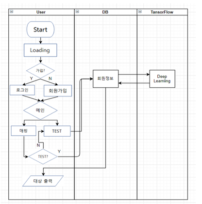
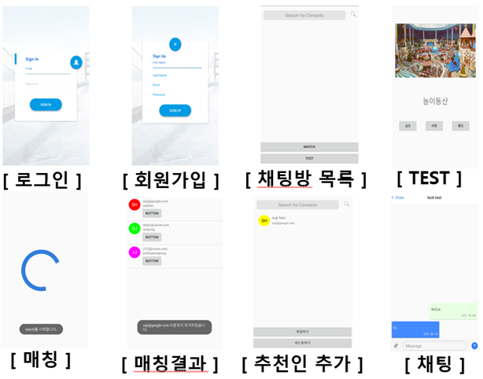

# 공주대 사랑방

## 1. 프로그램의 명칭
 국문 : 공주대 사랑방
 
 영문 : Kongju University Chat Application 

## 2. 프로그램의 상세한 설명
 2.1 프로그램이 속하는 기술분야
 
   채팅 애플리케이션
 
 2.2 프로그램이 이루고자 하는 기술적 과제
 
   사용자의 데이터를 제공받아 분석하여 예측한 결과를 가지고 사용자가 가장 원하는 채팅 상대를 추천해 주는 프로그램
 
 2.3 프로그램의 구성 및 작용
 
   작성한 프로그램의 전체적인 동작방식은 다음과 같다.
   
   
 
 2.4 프로그램의 사용방법

  ① 프로그램을 최초 실행하면 간단한 UI가 나타나며 회원가입 버튼과 로그인 버튼이 위치한다. 각각 회원가입과 로그인 기능을 담당하며 이 중 회원가입 버튼을 클릭하면 프로그램이 회원가입 화면으로 전환된다. 로그인 버튼을 클릭하면 가입된 아이디와 비밀번호를 입력할 수 있는 화면으로 전환된다. 

  ② 로그인 화면에서는 최초 실행화면에서 로그인 버튼을 클릭했을 경우에 나타난다.
    구성은 아이디, 비밀번호 텍스트 상자와 로그인 버튼 UI로 표현한다. 로그인 버튼을 클릭 하면 아이디와 비밀번호가 데이터베이스에 저장되어 있는지 확인한 후 있을 경우 메인화면으로 전환된다. 없을 경우 다시 입력하라는 메시지로 알려준다.

  ③ 로그인 성공시 메인화면으로 전환되며 메인화면에는 Match 버튼과 Test 버튼이 있다. 다른 사용자와 매칭을 위해 Match버튼을 누르면 먼저 테스트를 하라는 안내 팝업이 뜬다.   

  ④ 사용자는 테스트 버튼을 눌러 10가지 테스트를 하게 되며 테스트 화면에는 사진과 좋음, 보통, 싫음 버튼이 존재해 사용자는 세 가지 조건 중 한 가지를 선택한다. 선택된 정보는 서버에 전송되고 전송된 데이터는 딥 러닝을 통해 처리가 되며 처리된 결과 값이 다시 서버로 전송된다. 사용자는 이 결과 값을 가지고 다른 사용자와 매칭이 된다.

  ⑤ 테스트가 끝나면 사용자는 Match 버튼을 눌러 다른 사용자와 매칭 된다.

  ⑥ 매칭 결과, 사용자에겐 공주대 사랑방이 추천하는 친구 목록이 보인다. 친구 목록 구성에는 프로필 사진과 이메일, 이름 등이 보인다. 사용자는 맘에 드는 다른 사용자를 계정 정보 아래 있는 버튼으로 친구 등록 한다.

  ⑦ 등록한 친구는 사용자의 메인화면에 등록되어 보이게 되며 등록된 사용자를 선택하면 해당 사용자와 채팅이 가능하다.

  ⑧ 채팅은 하단에 있는 텍스트 버튼을 클릭하면 입력이 가능하며 입력된 텍스트는 텍스트 버튼 오른쪽에 있는 버튼으로 전송된다. 텍스트 버튼 왼쪽에는 사진이나 영상 등을 첨부할 수 있는 첨부버튼이 있다.
  
  

 
